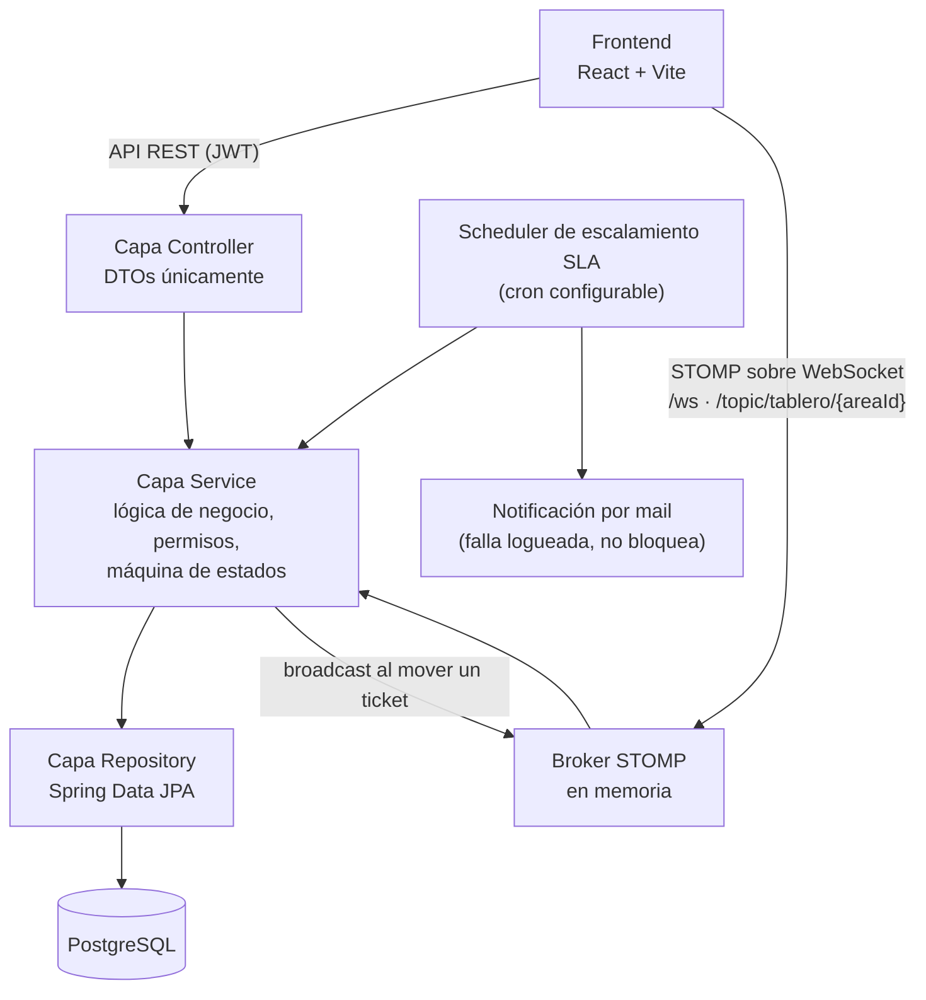
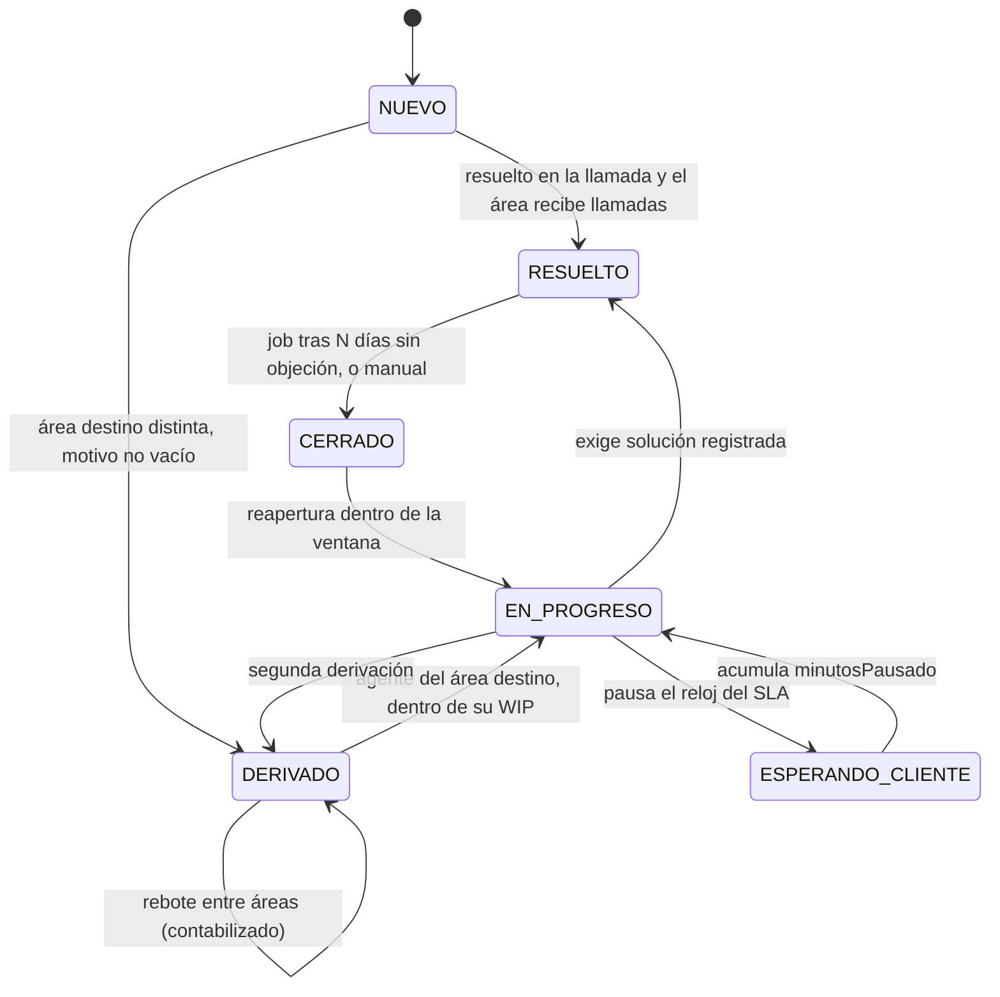

# Mesa de ayuda telefónica

Sistema de gestión de tickets de soporte originados en llamadas telefónicas.
El cliente llama, un agente levanta el ticket durante la llamada y lo resuelve
en línea o lo deriva a un área especializada. Ambos desenlaces quedan
registrados, con trazabilidad completa del historial de estados y las
derivaciones.

Proyecto académico de portafolio: prioriza claridad, trazabilidad y
testabilidad por sobre la cantidad de features.

## Stack

**Backend**
- Java 21, Spring Boot 3.3.4 (Web, Data JPA, Security, Validation, Mail, WebSocket)
- PostgreSQL 17 + Flyway para migraciones
- Maven
- JWT sin sesiones (jjwt) para autenticación
- WebSocket con STOMP para el tablero en vivo
- JUnit 5, Mockito, Testcontainers

**Frontend**
- React 19 + TypeScript + Vite
- React Router
- TanStack Query
- @dnd-kit (drag-and-drop del tablero)
- react-hook-form
- recharts (métricas)
- @stomp/stompjs (WebSocket)
- CSS Modules, sin librería de componentes

## Arquitectura

Paquetes del backend agrupados por feature, no por tipo técnico:

```
com.mesaayuda
├── config/        Security, CORS, WebSocket, Scheduler
├── auth/
├── usuario/
├── area/
├── contacto/
├── llamada/
├── ticket/
├── derivacion/
├── tablero/
├── sla/
├── metricas/
├── notificacion/
└── shared/
```



## Máquina de estados del ticket

Grafo definido en `EstadoTicket`; las guardas que consultan base de datos
viven en `TransicionService`. Cualquier transición fuera de este grafo lanza
excepción.



## Ejecución local

### (a) Nativa

Requiere PostgreSQL 17 corriendo localmente.

```
createdb mesa_ayuda   # o el equivalente en tu cliente de Postgres

export DB_PASSWORD=tu-clave-local
export JWT_SECRET=un-secreto-de-al-menos-32-caracteres

./mvnw spring-boot:run
```

En otra terminal, el frontend (usa `frontend/.env.development`, que ya
apunta `VITE_API_BASE_URL` a `http://localhost:8080`):

```
cd frontend
npm install
npm run dev
```

### (b) `docker compose up`

Levanta Postgres y el backend en contenedores.

```
cp .env.example .env
# completar DB_PASSWORD y JWT_SECRET en .env

docker compose up --build
```

Docker Compose carga `.env` automáticamente desde el mismo directorio, sin
flags adicionales. Este `docker-compose.yml` cubre backend + base de datos;
el frontend se corre aparte con `npm run dev` (ruta (a)), o se containeriza
con `frontend/Dockerfile` (build multi-stage con nginx, ver más abajo en
Despliegue) si preferís tener todo en contenedores.

No hay servicio de mail en el compose: `NotificacionService` captura
`MailException` y solo loguea el fallo sin propagar nada, así que el sistema
funciona completo sin un SMTP local — el job de escalamiento simplemente no
manda el correo y queda registrado en el log.

## Tests

```
./mvnw test
```

Desde este sprint, `./mvnw test` usa Testcontainers para levantar Postgres:
**requiere Docker corriendo**, pero ya no requiere una instancia nativa de
Postgres ni las variables `JWT_SECRET`/`DB_PASSWORD` seteadas a mano (el
secreto de test está fijado en `src/test/resources/application.yml`).

```
cd frontend
npm run build
```

`npm run build` corre `tsc -b` antes de `vite build`, así que además de
compilar sirve como type-check.

## WebSocket

Tablero en vivo sobre STOMP: endpoint `/ws` (sin SockJS), broker simple en
memoria, un topic por área (`/topic/tablero/{areaId}`). La autenticación no
pasa por el handshake HTTP —`/ws/**` está en `permitAll()` en
`SecurityConfig`— sino por el header `Authorization` dentro de
`connectHeaders` del frame STOMP `CONNECT`, validado por un interceptor STOMP
dedicado.

## Variables de entorno

| Variable | Requerida | Ejemplo | Secreto |
|---|---|---|---|
| `DB_HOST` | No | `localhost` | No |
| `DB_PORT` | No | `5432` | No |
| `DB_NAME` | No | `mesa_ayuda` | No |
| `DB_USERNAME` | No | `postgres` | No |
| `DB_PASSWORD` | Sí | — | Sí |
| `JWT_SECRET` | Sí | — | Sí |
| `SPRING_PROFILES_ACTIVE` | No | `dev` | No |
| `CORS_ALLOWED_ORIGINS` | No en dev / Sí en prod | `http://localhost:5173` | No |
| `MAIL_HOST` / `MAIL_PORT` / `MAIL_USERNAME` / `MAIL_PASSWORD` | No (solo prod) | — | Sí (usuario/clave) |
| `SLA_ESCALAMIENTO_UMBRAL_MINUTOS` | No | `30` | No |
| `SLA_ESCALAMIENTO_CRON` | No | `0 */5 * * * *` | No |
| `PORT` | No (la inyecta la plataforma) | `8080` | No |
| `VITE_API_BASE_URL` | Sí (frontend) | `http://localhost:8080` | No |

En `application-prod.yml`, `CORS_ALLOWED_ORIGINS` no tiene valor por
defecto: el arranque falla explícitamente si no se configuró, en vez de
quedar restringido a `localhost` en producción.

## Despliegue

Instructivo para desplegar en Railway o Render (ambos con free tier y
soporte nativo para "deploy from Dockerfile"):

1. Crear una cuenta y conectarla a GitHub.
2. Conectar el repositorio [`fati987/mesa-ayuda`](https://github.com/fati987/mesa-ayuda).
3. Crear primero la base de datos Postgres gestionada por la plataforma,
   para tener las credenciales (host, puerto, usuario, clave) a mano antes
   de configurar el backend.
4. Crear el servicio web del backend como "Deploy from Dockerfile",
   apuntando al `Dockerfile` de la raíz del repo.
5. Cargar en el servicio backend las variables de entorno de la tabla
   anterior, con los valores reales de la base creada en el paso 3 — excepto
   `CORS_ALLOWED_ORIGINS`, que se completa después, en el paso 8.
6. Desplegar y copiar la URL pública que asigna la plataforma al backend.
7. Crear el sitio del frontend: como Static Site nativo de la plataforma,
   con build command `cd frontend && npm ci && npm run build` y publish
   directory `frontend/dist` — o, alternativamente, como "deploy from
   Dockerfile" apuntando a `frontend/Dockerfile` (build con nginx). En
   cualquiera de los dos casos, setear `VITE_API_BASE_URL=<URL del backend
   del paso 6>` como variable de **build** (Vite la incrusta en el bundle en
   tiempo de compilación, no en runtime).
   - Si es un Static Site nativo (no `frontend/Dockerfile`), agregar además
     una regla de rewrite para el ruteo client-side de React Router: en
     Settings → Redirects/Rewrites → Add Rule, Source `/*`, Destination
     `/index.html`, Action **Rewrite** (no Redirect). Sin esto, cualquier
     ruta que no sea `/` (ej. `/login`, `/tablero`) da 404 al refrescar o
     entrar directo — el equivalente exacto de `frontend/nginx.conf` para
     el path con Docker.
8. Copiar la URL pública que asigna la plataforma al frontend, volver al
   servicio backend, setear `CORS_ALLOWED_ORIGINS=<URL del frontend>` y
   redesplegar.

**URL del despliegue**:
- Frontend: <https://mesa-ayuda-1.onrender.com>
- Backend (API + WebSocket): <https://mesa-ayuda-ff3h.onrender.com>

Verificado: el frontend sirve todas las rutas correctamente, el login real
contra la base gestionada devuelve tokens válidos, y CORS está configurado
para aceptar exactamente el origen del frontend desplegado.

## Estado de sprints

1. Núcleo: entidades, Flyway, CRUD de tickets y categorías, manejo de excepciones — hecho
2. Auth y roles: JWT, permisos por rol y por área — hecho
3. Flujo: máquina de estados, historial, derivaciones, límites de WIP, tablero — hecho
4. SLA: calendario laboral, cálculo de vencimientos, job de escalamiento, correos — hecho
5. Métricas: FCR, lead time, cycle time, tasa de derivación, cumplimiento de SLA — hecho
6. Frontend — hecho
7. Cierre: WebSocket/STOMP, Testcontainers, Docker, CI, despliegue — hecho
